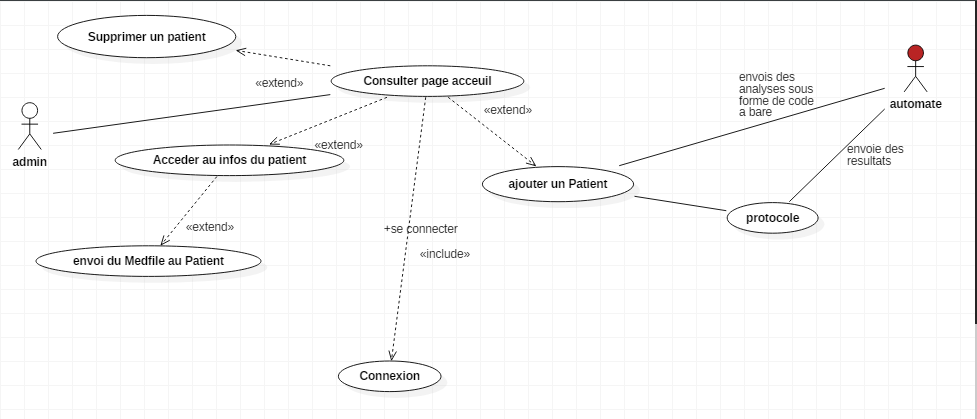
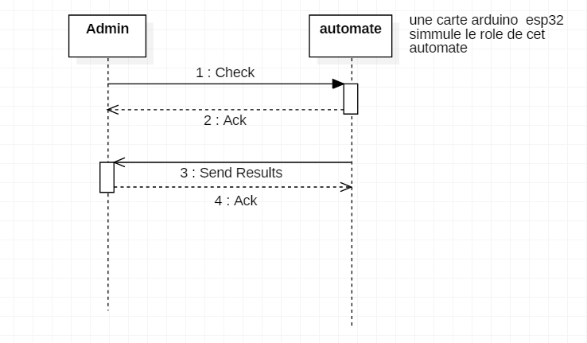
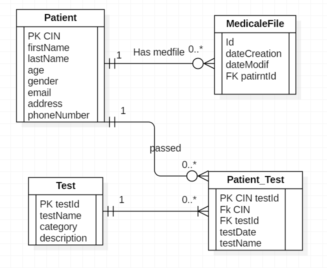

# Laboratory Information System (LIS)

## Description
Le système LIS est une application de gestion destinée à simplifier et optimiser les opérations quotidiennes d'un laboratoire médical. Il intègre des fonctionnalités comme la gestion des patients, des tests médicaux, des fichiers médicaux et la génération de rapports.

## Fonctionnalités Principales
- Gestion des patients
- Ajout et gestion des tests médicaux
- Gestion des dossiers médicaux
- Génération et lecture de QR codes
- Authentification utilisateur
- Génération de fichiers PDF

## Structure du Projet

Voici une vue d'ensemble de la structure du projet basée sur les images fournies :

```
LIS-G [Lis]
├── .idea
├── .mvn
├── src
│   ├── main
│   │   ├── java
│   │   │   └── ma.ensa.lis
│   │   │       ├── controllers
│   │   │       │   ├── AdminController
│   │   │       │   ├── AjoutPatientController
│   │   │       │   ├── deletePatient
│   │   │       │   ├── GenererLireBarcode
│   │   │       │   ├── loginController
│   │   │       │   ├── MedicalfileController
│   │   │       │   └── TestController
│   │   │       ├── dao
│   │   │       │   ├── MedicalFileDao
│   │   │       │   ├── PatientDao
│   │   │       │   ├── TestDao
│   │   │       │   └── Impl
│   │   │       │       ├── MedicalFileImp
│   │   │       │       ├── PatientDaoImp
│   │   │       │       └── TestDaoImp
│   │   │       ├── exceptions
│   │   │       │   ├── patientException
│   │   │       │   └── TestException
│   │   │       ├── models
│   │   │       │   ├── MedicalFile
│   │   │       │   ├── Patient
│   │   │       │   └── TestLab
│   │   │       └── utils
│   │   │           ├── DbConnection
│   │   │           ├── JsonUtils
│   │   │           ├── PDFGenerator
│   │   │           ├── QRCodeGenerator
│   │   │           └── useFullFunction
│   │   ├── resources
│   │   │   ├── ma.ensa.lis
│   │   │   │   ├── admin.css
│   │   │   │   ├── admin-view.fxml
│   │   │   │   ├── AjoutPatient-view.fxml
│   │   │   │   ├── deletePatient-view.fxml
│   │   │   │   ├── GenererLireBarcode.fxml
│   │   │   │   ├── login.css
│   │   │   │   ├── login-view.fxml
│   │   │   │   ├── medicalfile-view.fxml
│   │   │   │   ├── STYLE.css
│   │   │   │   ├── test-view.fxml
│   │   │   │   └── img
│   │   │   │       ├── img.png
│   │   │   │       ├── logo.png
│   │   │   │       └── schema.sql
├── test
│   ├── java
│   │   └── ma.ensa.lis
│   │       ├── controllers
│   │       │   └── TestControllerTest.java
│   │       ├── dao
│   │       │   └── Impl
│   │       │       ├── TestDAOTest
│   │       │       └── TestDaoImpTest.java
│   │       └── models
│   │           └── TestLabTest
├── target
├── pom.xml
└── README.md
```

## Installation
1. Clonez le projet :
   ```bash
   git clone <repository-url>
   ```
2. Importez le projet dans votre IDE préféré (IntelliJ, Eclipse, etc.).
3. Assurez-vous que Maven est installé et configuré correctement.
4. Exécutez les scripts de création de base de données fournis dans `schema.sql`.
5. Lancez l'application.

## Utilisation
1. Connectez-vous en utilisant les identifiants d'administration.
2. Naviguez entre les différentes vues pour gérer les patients, tests, et fichiers médicaux.
3. Générez des rapports PDF et des codes QR selon les besoins.

## Tests
Le projet inclut des tests unitaires dans le répertoire `test`. Pour les exécuter, utilisez la commande suivante :
```bash
mvn test
```

le diagramme use case simple représentatif:


le diagramme séquence représentatif:

le diagramme entity-association:


